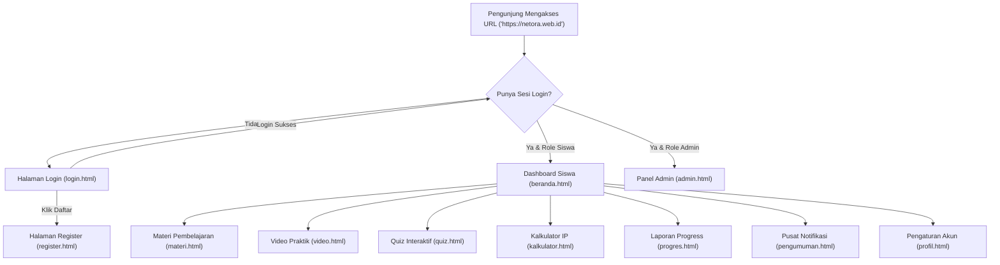

# 📋 Master Dokumentasi Sistem, Arsitektur, Hasil Akhir & Panduan Deployment NETORA v2

---

## 🌐 Informasi Live Production Proyek

| Parameter | Detail Konfigurasi Produksi |
|---|---|
| **Nama Aplikasi** | **NETORA v2 — Portal Pembelajaran TKJ** |
| **URL Domain Resmi (HTTPS)** | 👉 **`https://netora.web.id`** |
| **URL Server Pterodactyl Asli** | `http://203.175.125.151:2974` |
| **Panel Hosting** | FinCloud Pterodactyl (`https://panel.fincloud.my.id/server/1f5ca09c`) |
| **Node IP Server** | `203.175.125.151` |
| **Port Alokasi Pterodactyl** | **`2974`** |
| **DNS & CDN Provider** | Cloudflare Free Plan |
| **Cloudflare Nameservers** | `fattouche.ns.cloudflare.com` & `lorna.ns.cloudflare.com` |
| **Mode SSL / Enkripsi** | Cloudflare Flexible + Always Use HTTPS + Auto HTTPS Rewrites |
| **Port Forwarding Rule** | Cloudflare Origin Rule (Rewrite 443 $\rightarrow$ Destination Port `2974`) |
| **Cloud Database** | **Supabase Cloud (PostgreSQL)** |
| **Repository Git Resmi** | `https://github.com/netoraid/netora-project` |
| **Format Aplikasi Mobile** | Progressive Web App (PWA) & APK Ready via PWABuilder |

---

## 🚀 1. Overview & Visi Proyek

**NETORA v2** adalah platform aplikasi web pembelajaran interaktif terpadu untuk jurusan **Teknik Komputer dan Jaringan (TKJ)** berbasis *full-stack*. Aplikasi ini dirancang dengan antarmuka futuristik bertema **Dark Cyberpunk & Clean Modern** yang mengusung prinsip **Native Web App (Single Page Application Transition)** dan **Responsif Penuh**:
- **Desktop View ($\ge$ 992px)**: Tampil sebagai **Dashboard Pembelajaran Modern** yang leluasa (lebar maksimal 1180px) dengan tata letak multi-kolom simetris, header navigasi desktop, modul materi unggulan, dan laboratorium tugas siswa interaktif.
- **Mobile View ($<$ 992px)**: Tampil ringkas, bersih, ramah jempol (*mobile-first*), tanpa batasan bingkai ponsel tiruan yang membatasi layar fisik smartphone, dilengkapi *Bottom Navigation Bar* putih bersih dan gestur *Pull-to-Refresh*.

---

## 🛠️ 2. Tech Stack & Arsitektur Sistem

Aplikasi dibangun dengan teknologi yang ringan, cepat, tanpa overhead framework berat (*Vanilla Architecture*), sehingga memiliki portabilitas 100% di berbagai platform hosting dan container:

### A. Frontend (Klien)
- **HTML5 Semantik**: Struktur dokumen bersih, teroptimasi SEO, meta tag viewport mobile responsif, dan favicon terpasang di seluruh halaman.
- **Vanilla CSS3 (Design System Terpadu)**: 
  - Variabel CSS (`:root`), Flexbox, CSS Grid.
  - Efek visual modern: Glassmorphism, Ambient Glow, Keyframe Animation 60 FPS.
  - Dual Mode Visual: Cyberpunk Dark Mode & Clean White Card Layout.
- **Vanilla JavaScript ES6+**:
  - **Native SPA Transition Router**: Pergantian halaman instan tanpa reload dokumen, bebas layar putih (*zero-white-flash*).
  - **In-Memory Pre-Caching**: Memuat halaman di RAM browser untuk respon instan < 10ms.
  - **Dynamic State & DOM Manipulation**: Event binding otomatis, Async/Await Fetch API, Modal System, Toast Notification Engine.
- **Progressive Web App (PWA)**:
  - `manifest.json` terpasang untuk instalasi di Android/iOS (*standalone mode*).
  - `sw.js` (Service Worker) terdaftar untuk caching dan performa cepat.

### B. Backend (Server)
- **Node.js (v24+)**: Runtime JavaScript asynchronous berkinerja tinggi.
- **Express.js (v4.21+)**: Web application framework untuk routing RESTful API dan penyajian file statis.
- **Session Management (`express-session`)**: Pengelolaan autentikasi berbasis cookie `httpOnly` dengan masa aktif 24 jam dan dukungan reverse proxy (`app.set('trust proxy', 1)`).
- **Keamanan Sandi (`bcryptjs`)**: Password hashing dengan algoritma salt 10 rounds (100% Pure JavaScript, tanpa kompilasi native C++).
- **File Upload Engine (`multer`)**: Pengunggahan foto profil avatar ke direktori `public/uploads/` dengan filter ekstensi gambar dan batasan ukuran berkas (maks 5MB).
- **CORS & Body Parser**: Terintegrasi untuk mendukung integrasi API lintas perangkat.

### C. Basis Data (Database)
- **Engine**: **Supabase Cloud (PostgreSQL)**.
- **Client**: **`@supabase/supabase-js`** terintegrasi langsung dengan backend Express.js.
- **Kredensial**: Menggunakan `SUPABASE_SERVICE_ROLE_KEY` untuk operasi backend penuh dan RLS (*Row Level Security*) pada tabel publik.
- **Fitur Utama**: Skalabilitas cloud, relasi integritas referensial penuh (Foreign Key `ON DELETE CASCADE`), indeks performa tinggi, dan backup cloud otomatis.

---

## 📁 3. Struktur File & Direktori Proyek

```
Netora/
├── server.js                  # Entrypoint server Express & port binding dinamis (SERVER_PORT)
├── package.json               # Konfigurasi dependensi Pure JS & engines Node.js
├── package-lock.json          # Lockfile dependensi npm
├── planing.md                 # Master dokumentasi sistem, arsitektur, dan panduan deploy
├── .env                       # File konfigurasi rahasia Supabase & Port (terlindungi .gitignore)
├── .env.example               # Template variabel lingkungan untuk server/deploy
├── .gitignore                 # Filter berkas keamanan (node_modules, .env, *.mp4, *.apk)
├── logo.png                   # Master logo Netora
│
├── database/
│   ├── init.js                # Wrapper query kompatibilitas aplikasi
│   ├── supabase.js            # Inisialisasi Supabase Client & verifikasi koneksi cloud
│   └── supabase_schema.sql    # DDL skema 6 tabel PostgreSQL Supabase + initial data seed
│
├── middleware/
│   └── auth.js                # Middleware proteksi route session (requireAuth & admin check)
│
├── routes/
│   ├── auth.js                # Endpoint Login, Register, Logout, & Session Me
│   ├── materi.js              # Endpoint Katalog & Detail Modul Materi
│   ├── video.js               # Endpoint Galeri Video Praktikum Mikrotik
│   ├── quiz.js                # Endpoint Soal Quiz & Perhitungan Skor
│   ├── pengumuman.js          # Endpoint Pengumuman & Notifikasi
│   ├── profil.js              # Endpoint Profil, Password, Avatar, & Hapus Akun Siswa
│   └── admin.js               # Endpoint CRUD Lengkap Khusus Admin
│
└── public/                    # Seluruh Halaman & Aset Web (Static Web Root)
    ├── manifest.json          # Manifest PWA (Nama aplikasi, warna tema, logo)
    ├── sw.js                  # Service Worker PWA (Cache fallback)
    ├── assets/
    │   ├── logo.png           # Logo master Netora
    │   ├── banner1.jpg        # Banner ilustrasi materi
    │   └── banner2.jpg        # Banner ilustrasi praktikum
    ├── uploads/
    │   └── default.png        # Avatar default pengguna & folder unggahan foto
    ├── css/
    │   └── netora.css         # Master Stylesheet (Desktop, Mobile, Animasi SPA, Layout)
    ├── js/
    │   ├── netora.js          # Engine SPA Router, PWA Auto-register, Toast, Header Sync
    │   ├── auth.js            # Logika Login, Register, & Validasi Input
    │   ├── beranda.js         # Inisialisasi Beranda & Carousel
    │   ├── materi.js          # Inisialisasi & Filter Katalog Materi
    │   ├── video.js           # Inisialisasi Galeri & Video Player Modal
    │   ├── quiz.js            # State Machine Kuis Interaktif (Bebas ghost card saat kosong)
    │   ├── kalkulator.js      # Algoritma Subnetting RFC 791/4632 & Riwayat Lokal
    │   ├── progres.js         # Statistik Pembelajaran & Riwayat Nilai
    │   ├── pengumuman.js      # Daftar Notifikasi & Pengumuman
    │   ├── profil.js          # Tab Edit Profil, Keamanan, Ganti Avatar, & Hapus Akun
    │   └── admin.js           # Single Page Application Dashboard Admin
    │
    ├── beranda.html           # Dashboard Utama Siswa (4 Modul Inti & Lab Tugas)
    ├── materi.html            # Katalog Modul Pembelajaran (Grid 2 Kolom)
    ├── materi-detail.html     # Pembaca Modul Lengkap
    ├── video.html             # Galeri Video Praktik RouterOS
    ├── quiz.html              # Uji Kompetensi Interaktif
    ├── kalkulator.html        # Kalkulator Subnetting & CIDR Split Desktop
    ├── progres.html           # Laporan Capaian Belajar Siswa
    ├── pengumuman.html        # Pusat Pengumuman & Informasi
    ├── profil.html            # Profil Pengguna & Pengaturan Akun
    ├── login.html             # Halaman Masuk Multi-Role
    ├── register.html          # Halaman Pendaftaran Siswa
    ├── admin.html             # Panel Kontrol Manajemen Admin
    └── tentang.html           # Informasi Versi Aplikasi & Pengembang
```

---

## 🗄️ 4. Skema Basis Data Supabase Cloud (PostgreSQL)

Telah termigrasi 100% dari SQLite lokal ke **Supabase PostgreSQL** dengan DDL pada file `database/supabase_schema.sql`:

1. **`users`**:
   - `id` (SERIAL PRIMARY KEY)
   - `nama` (VARCHAR 255), `email` (VARCHAR 255 UNIQUE), `password` (VARCHAR 255 HASH BCRYPT)
   - `foto` (TEXT, default: `uploads/default.png`), `bio` (TEXT)
   - `role` (VARCHAR 50, default: `'siswa'`, opsi: `'admin'`)
   - `created_at` (TIMESTAMP WITH TIME ZONE DEFAULT NOW())
2. **`materi`**:
   - `id` (SERIAL PRIMARY KEY), `judul` (VARCHAR 255), `kategori` (VARCHAR 100), `isi` (TEXT), `created_at` (TIMESTAMPTZ)
   - *(Kategori: Cisco, Mikrotik, Server & Linux, Jaringan Dasar)*
3. **`video`**:
   - `id` (SERIAL PRIMARY KEY), `judul` (VARCHAR 255), `deskripsi` (TEXT), `url_youtube` (TEXT)
   - `kategori` (VARCHAR 100), `durasi` (VARCHAR 50), `created_at` (TIMESTAMPTZ)
4. **`quiz`**:
   - `id` (SERIAL PRIMARY KEY), `pertanyaan` (TEXT)
   - `pilihan_a` (TEXT), `pilihan_b` (TEXT), `pilihan_c` (TEXT), `pilihan_d` (TEXT)
   - `jawaban_benar` (VARCHAR 10), `kategori` (VARCHAR 100), `created_at` (TIMESTAMPTZ)
5. **`nilai_quiz`**:
   - `id` (SERIAL PRIMARY KEY), `user_id` (INTEGER REFERENCES users(id) ON DELETE CASCADE)
   - `skor` (INTEGER), `tanggal` (TIMESTAMPTZ DEFAULT NOW())
6. **`pengumuman`**:
   - `id` (SERIAL PRIMARY KEY), `judul` (VARCHAR 255), `isi` (TEXT), `kategori` (VARCHAR 100)
   - `penting` (BOOLEAN DEFAULT FALSE), `created_at` (TIMESTAMPTZ)

---

## 🔌 5. Daftar Endpoint RESTful API

### 🔐 Autentikasi (`/api/auth`)
- `POST /api/auth/register` : Mendaftarkan siswa baru.
- `POST /api/auth/login` : Masuk akun siswa / admin.
- `POST /api/auth/logout` : Menghapus session aktif.
- `GET /api/auth/me` : Mendeteksi session login saat ini.

### 📚 Modul Pembelajaran (`/api/materi`)
- `GET /api/materi` : Mengambil seluruh katalog materi.
- `GET /api/materi/:id` : Mengambil detail baca modul materi.

### 🎥 Video Tutorial (`/api/video`)
- `GET /api/video` : Mengambil daftar video tutorial YouTube.

### 📝 Kuis Interaktif (`/api/quiz`)
- `GET /api/quiz` : Mengambil daftar soal kuis aktif tanpa membocorkan kunci jawaban.
- `POST /api/quiz/submit` : Menghitung skor kuis & menyimpan nilai (jika login).
- `GET /api/quiz/riwayat` : Riwayat nilai ujian siswa yang login.

### 📢 Pengumuman (`/api/pengumuman`)
- `GET /api/pengumuman` : Mengambil pengumuman aktif.

### 👤 Profil & Akun Siswa (`/api/profil`)
- `GET /api/profil` : Data profil & riwayat belajar siswa.
- `PUT /api/profil/update` : Memperbarui nama dan bio.
- `PUT /api/profil/ganti-password` : Mengganti kata sandi.
- `POST /api/profil/upload-foto` : Mengunggah foto profil (Multipart Form).
- `DELETE /api/profil/hapus-foto` : Mereset foto profil ke default.
- `DELETE /api/profil/hapus-akun` : Menghapus akun siswa mandiri dengan validasi password.

### 🛡️ Manajemen Admin (`/api/admin`)
- `GET /api/admin/stats` : Statistik total siswa, materi, video, dan quiz.
- `GET /api/admin/aktivitas` : Log aktivitas siswa terkini.
- `GET /api/admin/siswa` : Daftar seluruh siswa.
- `POST /api/admin/siswa` : Menambahkan akun siswa baru secara manual.
- `PUT /api/admin/siswa/:id/password` : Reset kata sandi siswa.
- `DELETE /api/admin/siswa/:id` : Menghapus akun siswa.
- `POST /api/admin/reset-siswa` : Reset massal data siswa non-admin.
- CRUD Materi: `GET`, `POST`, `PUT`, `DELETE` ke `/api/admin/materi`.
- CRUD Video: `GET`, `POST`, `PUT`, `DELETE` ke `/api/admin/video`.
- CRUD Quiz: `GET`, `POST`, `PUT`, `DELETE` ke `/api/admin/quiz`.
- CRUD Pengumuman: `GET`, `POST`, `DELETE` ke `/api/admin/pengumuman`.

---

## 🧭 6. Alur Pengguna & Sistem Hak Akses (User Flow)



---

## 🌐 7. Panduan Deployment Lengkap ke Pterodactyl Panel (FinCloud)

Server produksi Netora v2 berjalan di container **Pterodactyl Panel FinCloud** dengan spesifikasi:

### A. Data Alokasi & Server Node
- **URL Panel**: `https://panel.fincloud.my.id/server/1f5ca09c`
- **Server UUID**: `1f5ca09c-d28f-4aad-b877-1d5747d3305f`
- **Node IP**: `203.175.125.151`
- **Port Alokasi Pterodactyl**: **`2974`**
- **Environment**: FinCloud Node.js Environment (Node v24.14.1)

### B. Variabel Lingkungan (`.env`) pada Pterodactyl Files
Di File Manager Pterodactyl, buat/edit file `.env`:
```env
PORT=2974
SERVER_PORT=2974
SERVER_IP=203.175.125.151
SESSION_SECRET=netora_cyberpunk_secret_key_2026
SUPABASE_URL=https://dkzebtyoboqxojigyjnv.supabase.co
SUPABASE_SERVICE_ROLE_KEY=eyJhbGciOiJIUzI1NiIsInR5cCI6IkpXVCJ9...
```

### C. Mekanisme Dynamic Port Binding di `server.js`
Kode `server.js` dikonfigurasi untuk memprioritaskan port alokasi container:
```javascript
const PORT = process.env.SERVER_PORT || process.env.PORT || 3000;
const HOST = '0.0.0.0';
```
Hal ini memastikan saat dijalankan di Pterodactyl, Express otomatis mengikat port `2974` di `0.0.0.0` sehingga bisa diakses dari jaringan luar.

### D. Fitur Auto-Update Git Bawaan FinCloud
Egg Pterodactyl FinCloud telah dilengkapi skrip auto-pull:
- Setiap kali Anda menekan tombol **Restart** di panel, container otomatis menjalankan:
  ```text
  [+] Updating from Git...
  Already up to date / Fast-forward
  ```
- Dengan demikian, setiap perubahan kode yang di-push ke GitHub akan otomatis terpasang hanya dengan mengklik tombol **Restart** di Pterodactyl!

---

## 🔒 8. Panduan Lengkap Cloudflare, Domain `netora.web.id` & SSL

Seluruh lalu lintas domain diarahkan melalui jaringan **Cloudflare** untuk memberikan sertifikat SSL/HTTPS gratis, proteksi DDoS, dan menghilangkan nomor port alokasi Pterodactyl.

### 8.1. Konfigurasi Nameserver di DomaiNesia
Domain `netora.web.id` didaftarkan di DomaiNesia dan diarahkan ke Cloudflare dengan nameserver:
- **Nameserver 1**: `fattouche.ns.cloudflare.com`
- **Nameserver 2**: `lorna.ns.cloudflare.com`

### 8.2. Pengaturan DNS Records di Cloudflare
Pada menu **DNS** $\rightarrow$ **Records** di dashboard Cloudflare:
1. **Record A (Apex Domain)**:
   - **Type**: `A`
   - **Name**: `@` *(netora.web.id)*
   - **IPv4 Address**: `203.175.125.151`
   - **Proxy status**: **Proxied** (Awan Orange ☁️)
2. **Record CNAME (Subdomain WWW)**:
   - **Type**: `CNAME`
   - **Name**: `www`
   - **Target**: `netora.web.id`
   - **Proxy status**: **Proxied** (Awan Orange ☁️)

### 8.3. Pengaturan SSL / TLS (HTTPS)
Pada menu **SSL/TLS**:
1. **SSL/TLS Overview**:
   - Mode Enkripsi: **Flexible** *(Menghubungkan klien dengan HTTPS modern, lalu berkomunikasi cepat ke container Pterodactyl)*.
2. **Edge Certificates**:
   - **Always Use HTTPS**: **ON** *(Otomatis mengalihkan http:// ke https://)*.
   - **Automatic HTTPS Rewrites**: **ON** *(Mencegah error mixed content)*.
   - **Minimum TLS Version**: `TLS 1.2` / `TLS 1.3`.

### 8.4. Cloudflare Origin Rules: Trik Bebas Port (Menghilangkan :2974)
Agar siswa bisa membuka **`https://netora.web.id`** secara bersih tanpa perlu mengetik port `:2974`:
1. Buka menu **Rules** $\rightarrow$ **Origin Rules**.
2. Buat aturan baru (**Create rule**):
   - **Rule name**: `port-netora`
   - **When incoming requests match**: `All incoming requests` *(atau Hostname equals `netora.web.id`)*.
   - **Destination Port**: Pilih **Rewrite to...** lalu masukkan **`2974`**.
3. Klik **Deploy**.

> 💡 **Cara Kerja:** Siswa mengetik `https://netora.web.id` di browser (standar port HTTPS 443). Cloudflare menerima request tersebut dan meneruskannya ke port `2974` di IP server Pterodactyl secara transparan di latar belakang. Siswa melihat alamat URL bersih dengan gembok SSL hijau!

---

## 📱 9. Pembuatan Aplikasi Mobile Android (.apk & PWA)

Aplikasi Netora v2 dirancang dengan konsep **Mobile-First App Shell**. Terdapat 2 opsi distribusi untuk siswa:

### Opsi A: Progressive Web App (PWA - Langsung dari Browser)
1. Siswa membuka `https://netora.web.id` di Google Chrome pada smartphone Android.
2. Browser otomatis menampilkan prompt: **"Tambahkan Netora ke Layar Utama" / "Install Aplikasi Netora"**.
3. Setelah diinstal, Netora muncul di menu aplikasi HP dengan logo resmi, berjalan *full screen* tanpa address bar browser layaknya aplikasi native Play Store.
4. Diatur melalui file `public/manifest.json` dan `public/sw.js`.

### Opsi B: Build File APK Siap Pasang via PWABuilder (Gratis & Instan)
Untuk membagikan installer fisik `.apk` ke grup WhatsApp kelas atau mengupload ke Google Play Store:
1. Buka situs resmi Microsoft PWA: [https://www.pwabuilder.com](https://www.pwabuilder.com).
2. Masukkan URL: `https://netora.web.id` $\rightarrow$ klik **Start**.
3. PWABuilder akan memvalidasi Manifest dan Service Worker (skor 100/100 PWA Ready).
4. Klik **Package for Android**.
5. Konfigurasi Package:
   - **Package ID**: `id.web.netora.app`
   - **App Name**: `Netora - Belajar TKJ`
   - **Launcher Icon**: Otomatis menggunakan `logo.png` Netora.
6. Klik **Download Package** $\rightarrow$ file `netora.apk` langsung siap diinstal di HP siswa!

---

## 🔄 10. Alur Kerja Pembaruan Kode (Git CI/CD Workflow)

Untuk memperbarui kode di masa mendatang tanpa perlu membuka panel Pterodactyl atau upload ZIP manual:

### Cara dari VS Code (GUI / Klik-Klik Saja):
1. Lakukan perubahan kode pada file di VS Code laptop Anda.
2. Buka tab **Source Control** di sidebar kiri (atau tekan `Ctrl + Shift + G`).
3. Ketik pesan perubahan di kolom teks (misal: `tambah materi cisco baru`).
4. Klik tombol centang biru **Commit**.
5. Klik tombol **Sync Changes** (atau **Push**).
6. Buka panel Pterodactyl $\rightarrow$ klik tombol **Restart**.
   *(FinCloud otomatis menjalankan `[+] Updating from Git...` dan server langsung aktif dengan kode terbaru dalam hitungan detik!)*

---

## ✅ 11. Master Checklist Status Deployment

| No | Komponen Sistem | Target Konfigurasi | Status | Keterangan |
|---|---|---|:---:|---|
| 1 | **Database Cloud** | Supabase PostgreSQL | ✅ Aktif | 6 tabel termigrasi & terverifikasi |
| 2 | **Git Repository** | GitHub `netoraid/netora-project` | ✅ Aktif | Source code tersinkronisasi aman |
| 3 | **Server Pterodactyl** | FinCloud Node.js (`203.175.125.151:2974`) | ✅ Aktif | Server online & database connected |
| 4 | **Domain Registrar** | DomaiNesia (`netora.web.id`) | ✅ Aktif | Nameserver diarahkan ke Cloudflare |
| 5 | **Cloudflare DNS** | Record A $\rightarrow$ `203.175.125.151` | ✅ Aktif | Mode Proxied ☁️ menyala |
| 6 | **Sertifikat SSL** | Cloudflare Edge Certificate | ✅ Aktif | Mode Flexible & Always Use HTTPS |
| 7 | **Bebas Port (Rewrite)** | Origin Rules $\rightarrow$ Port `2974` | ✅ Aktif | Siswa akses https://netora.web.id |
| 8 | **PWA & APK Mobile** | Manifest & Service Worker | ✅ Siap | Ready Add-to-Home & PWABuilder |

---

*Dokumentasi ini mencerminkan konfigurasi final arsitektur sistem produksi NETORA v2 — Tim Pengembang Netora © 2026.*
